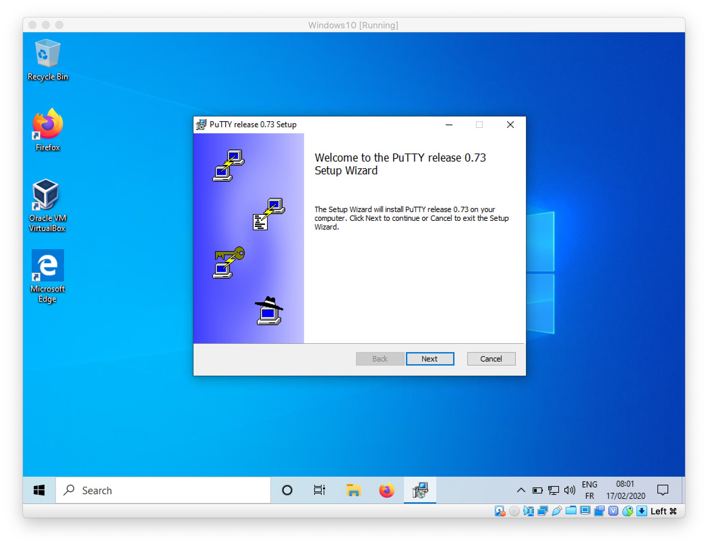
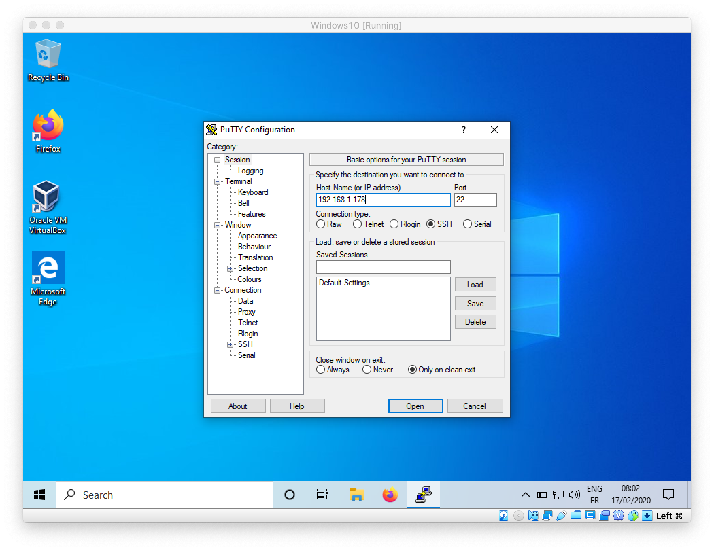
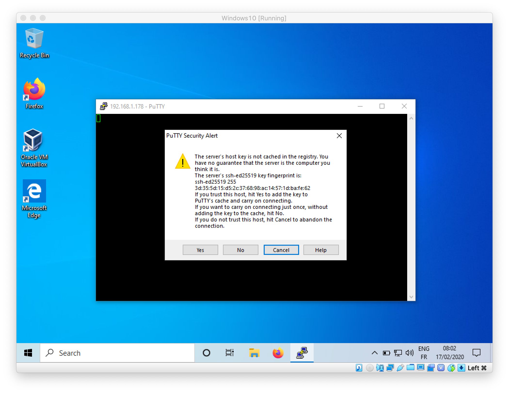
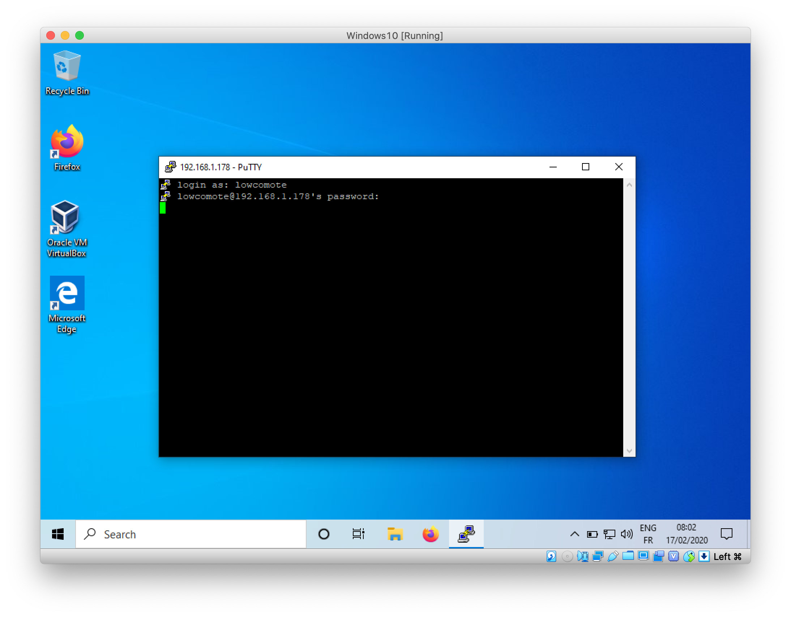

# Getting started with PuTTY, an opensource SSH client for windows
1. TOC
{:toc}

## Download PuTTY

Browse to [https://www.putty.org/](https://www.putty.org/) and find a link to download the PuTTY binary for your version of windows. You may directly download a 32 bit version [here](https://the.earth.li/~sgtatham/putty/latest/w32/putty-0.73-installer.msi). Once downloaded, proceed with the instructions below.

## Installation

Start the installer, and proceed with the default settings.

## Testing the connection

Now open PuTTY, you should land on the following screen:

Enter the IP address of the VM you are attempting to connect and click on **Open**. For the first connection, a screen will ask you to confirm that the details on the identification of the remote Host are correct, as follow:

Confirm that the informations are correct by clicking on **Yes**. You should now land on a screen asking your credentials. For the VM configured in the context of this practical session, use the following credentials:
- username: `lowcomote`
- password: `password`

Enter the credentials as in the following screenshot:

You should now be connected and able to run commands on the virtual machine!

