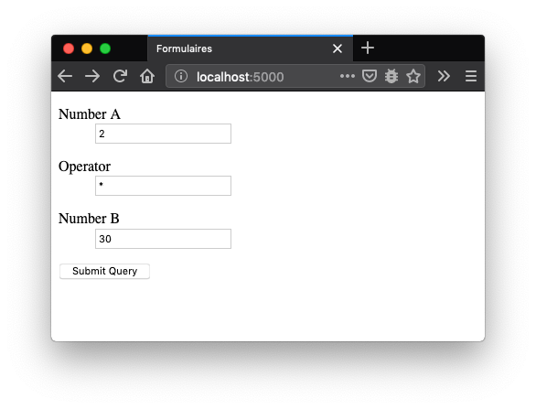
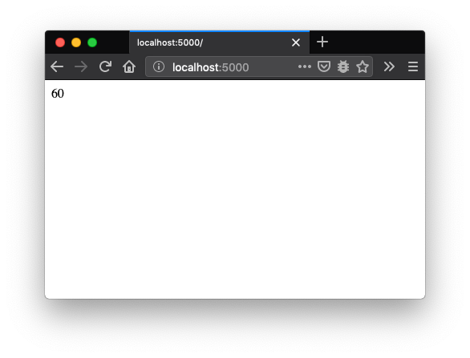

1. TOC
{:toc}


# Rappels sur les formulaires

Les formulaires sont une manière de demander de l'information aux
utilisateurs. Ils fonctionnent de la même manière que les formulaires
administratifs:

| Étape | Formulaire administratif | Formulaire Flask             |
|:--: |:------------------------------------|:------------------|
| `Développement`{: .label .label-blue} | | |
| 0 | Définition d'un formulaire (avec Word)  | Définition d'une classe héritant de `flask_wtf.Form` et d'une vue qui génère un formulaire HTML |
| `Fonctionnement`{: .label .label-blue} | | |
| 1 | Un utilisateur prend contact à un guichet | Un utilisateur accède à une vue Flask via un navigateur web  |
| 2 | L'agent administratif demande à l'utilisateur ce qu'il veut | Flask route la requête à la bonne fonction Python |
| 3 | L'agent imprime un nouveau formulaire  correspondant à la demande         | Flask génère un formulaire HTML grâce à la template, et utilise l'état de avec l'objet héritant de `flask_wtf.Form` pour préremplir les entrées |
| 4 | L'agent donne le formulaire à l'utilisateur | Flask retourne le formulaire HMTL à l'utilisateur  |
| 5 | **L'utilisateur remplit le formulaire** | **L’utilisateur remplit le formulaire** |
| 6 | L'utilisateur donne le formulaire à l'agent | L'utilisateur clique sur le bouton `submit` |
| 7 | L'agent vérifie les informations du formulaire | La fonction `form.validate_on_submit()` vérifie les informations du formulaire |
| `Si le formulaire est bien rempli`{: .label .label-green} | | |
| 8 | L'agent accepte le formulaire et prend en compte la demande | Flask accepte le formulaire et fait des modifications en base de données |
| `Si le formulaire est mal rempli`{: .label .label-red} | | |
| 9 | Retour à l'étape 5 | Retour à l'étape 3 (en sauvegardant les informations entrées par l'utilisateur dans l'objet héritant `flask_wtf.Form`) | 

De manière générale, pour implémenter correctement un formulaire avec
Flask nous écrirons trois fonctions Python:
* une fonction `create_or_process_form` qui sera en charge de récupérer une requête HTTP et de faire appel à une des deux fonctions suivantes.
* une fonction `display_form_post` qui affiche le formulaire:
  * vide lors du premier essai de remplissage
  * prérempli lors des essais supplémentaires
* une fonction `do_something` qui
  * traite les entrées du formulaire préalablement validé
  * redirige l'utilisateur une fois le traitement fait


et un objet `form` héritant de la classe `flask_wtf.Form`, qui va
définir les entrées du formulaire, leurs contraintes, et qui à terme
contiendra les états persistants de ces entrées (.i.e pour lors de
plusieurs essais, les utilisateurs n'aient pas à resaisir les entrées
déjà saisies).

L'image ci-dessus résume le fonctionnement du formulaire avec la convention précédemment décrite:


# Un formulaire pour calculer des expressions mathématiques

Dans cette section nous allons coder un formulaire qui permettra de
calculer des expressions mathématiques avec un formulaire. Le
formulaire ressemblera à cela:



En validant le formulaire figurant dans l'image précédente,
l'expression mathématique correspondante sera calculée, et le résultat
de son évaluation sera affiché comme suit:




## Récupération du projet à compléter

<!-- Depuis PyCharm, récupérez le contenu de la branche -->
<!-- **formulaires**, en suivant les [instructions -->
<!-- suivantes](git.html#r%C3%A9cup%C3%A9rer-le-code-dune-branche-git-avec-pycharm). -->

Avec votre navigateur, cliquez sur ce [lien (vers formulaires.zip)](https://github.com/badock/FlaskSar2019ExampleApp/archive/formulaires.zip) pour récupérer une archive ZIP du [dépôt formulaires](https://github.com/badock/FlaskSar2019ExampleApp/tree/formulaires) permettant de démarrer cet exercice.

Ce projet une application Flask basique qu'il faudra compléter.

__Ce projet fournit un fichier `templates/forms.html.jinja2` contenant
une macro (fonction) Jinja2 `render_field`, simplifiant l'affichage
des entrées d'un formulaire__, ce qui sera pratique pour les sessions
suivantes:


``` jinja

    <dl>
        <dt>{{ field.label }}</dt>
        <dd>{{ field(**kwargs)|safe }}
            
                <ul class=errors>
                    
                        <li>{{ error }}</li>
                    
                </ul>
            
        </dd>
    </dl>

```


Cette macro prend en entrée un objet "entrée" d'un formulaire
héritant de `flask_wtf.Form`, et se charge d'afficher:
* l'étiquette (label) du formulaire
* le code HTML pour afficher le formulaire
* le code HTML pour afficher d'éventuels messages d'erreurs lors de la
  validation du formulaire

## Définition de la représentation logique d'un formulaire

Tout d'abord, ajoutons au fichier `sar2019/forms.py` une
représentation logique de notre Fomulaire:

``` python
# Import des bibliotheque permettant de manipuler des formulaires HTML en Python
from flask_wtf import Form
from wtforms import StringField, IntegerField
from wtforms.validators import DataRequired, ValidationError

# Creation d'une classe heritant de 'flask_wtf.Form'
class AdditionForm(Form):
    # Definition de trois entrees, comme sur une des capture d'ecran precedentes
    number_a = IntegerField('Number A', validators=[DataRequired()])
    number_b = IntegerField('Number B', validators=[DataRequired()])
    operator = StringField('Operator', validators=[DataRequired()])
```

On peut noter les éléments suivants:
* Pour chaque formulaire de notre application Flask, une classe héritant de `flask_wtf.Form` est définie.
* À chaque entrée d'un formulaire, un attribut (de type  `StringField`, `IntegerField`, ...) est défini.
* Le premier paramètre d'une entrée correspond à son nom. Il sera aussi utilisé comme valeur d'étiquette par défaut.
* On peut associer des "validators" à chaque entrée.

## Ajout du formulaire dans Flask

Dans le fichier `app.py`, définir une fonction
`fonction_formulaire_addition` qui crée un objet de type
`AdditionForm`, et qui vérifiera si le formulaire doit être présenté
aux utilisateurs, ou s'il est dans un état validable.

```python
@app.route("/add", methods=["GET", "POST"])
@app.route("/", methods=["GET", "POST"])
def fonction_formulaire_addition():

    form = AdditionForm()

    if form.validate_on_submit():
        return traitement_formulaire_addition(form)
    else:
        return afficher_formulaire_addition(form)
```

Nous pouvons faire les observations suivantes:
- Création d'un objet `form` à partir de la classe `AdditionForm`. Cet
  objet contiendra les états (variables, données ...) du formulaire,
  et mettra en place les comportements nécessaires à la validation du
  formulaire.
- `form` possède une méthode de classe `validate_on_submit()`, qui
  indique si le formulaire est validable:
   - l'utilisateur a rempli toutes les entrées
   - les entrées sont correctement remplies

Les fonctions `traitement_formulaire_addition` et
`afficher_formulaire_addition` seront introduites dans la suite de
cette Section.

## Affichage du formulaire

Il faut définir la fonction `afficher_formulaire_addition` qui fait
appel à une template:

```python
def afficher_formulaire_addition(form):
    return flask.render_template("form_addition.html.jinja2", form=form)
```

La template `templates/form_addition.html.jinja2` est définie de la
manière suivante:


``` jinja


<html>
    <head>
        <title>Formulaires</title>
    </head>
    <body>
    <form action="{{ url_for("fonction_formulaire_addition") }}" method="post">
        {{ form.hidden_tag() }}

        {{ render_field(form.number_a) }}
        {{ render_field(form.operator) }}
        {{ render_field(form.number_b) }}

        <input type="submit">
    </form>
    </body>
</html>
```


Nous pouvons faire les observations suivantes:
- La template récupère la macro Jinja2 `render_field` grâce à l'instruction ``
- Chaque entrée du formulaire est affichée grâce à un appel du style `{{ render_field(form.<nom_entree>) }}`
- On indique où envoyer la template avec l'instruction  `action="{{ url_for("fonction_formulaire_addition") }}"`. 
- La  fonction `url_for` prend en paramètre le nom et les arguments d'une fonction python, et retourne une URL qui cible cette fonction.

## Traitement des données reçues par le formulaire

La fonction de traitement des résultats du formulaire ressemble à cela:

```python
def traitement_formulaire_addition(form):
    expression = "%s %s %s" % (form.number_a.data,
                               form.operator.data,
                               form.number_b.data)
    resultat = "%s" % eval(expression)
    return resultat
```

On peut noter que:
* les entrées d'un formulaire deviennent des attributs de l'objet `form` et sont accessibles sous forme d'attribut `form.<nom-de-l-entree>`

## (bonus) Sécurisation du formulaire

```python
def operator_check(form, field):
    authorized_operator = ["+", "-", "*", "/", "%"]
    if field.data not in authorized_operator:
        raise ValidationError('Field must be in %s' % authorized_operator)
```

```python
# Add 'operator_check' to the checkers
operator = StringField('Operator', validators=[DataRequired(), operator_check])
```


# Étude d'un formulaire fonctionnel pour éditer des posts

<!-- Depuis PyCharm, récupérez le contenu de la branche -->
<!-- **TP1_formulaires**, en suivant les [instructions -->
<!-- suivantes](git.html#r%C3%A9cup%C3%A9rer-le-code-dune-branche-git-avec-pycharm). -->

Avec votre navigateur, cliquez sur ce [lien (vers
TP1_formulaires.zip)](https://github.com/badock/FlaskSar2019ExampleApp/archive/TP1_formulaires.zip)
pour récupérer une archive ZIP du dépôt
[TP1_formulaires](https://github.com/badock/FlaskSar2019ExampleApp/tree/TP1_formulaires)
permettant de démarrer cet exercice.

Le projet que vous venez de récupérer est un projet Flask complet qui
servira de base pour expliquer les éléments introduits lors des
prochaines sessions. Il affiche des posts écrits par des auteurs, le
tout stocké dans une base de données simple.

Dans cet exemple d'application, un post contient 3 données:
1. un titre _sous forme de texte_
2. un contenu _sous forme de texte_

**Nous allons maintenant voir comment fonctionne le formulaire pour
créer ou éditer un post.**

## Définition du modèle pour le formulaire

Dans le fichier `sar2019/forms.py`, nous allons créer une classe
`PostEditForm` qui contiendra une description "logique" de notre
formulaire:

```python
from flask_wtf import Form
from wtforms import StringField, TextAreaField
from wtforms.validators import DataRequired

class PostEditForm(Form):
    title = StringField('Title', validators=[DataRequired()])
    content = TextAreaField('Content', validators=[DataRequired()])
```

Nous pouvons faire les observations suivantes:
* La classe `PostEditForm` hérite de `flask_wtf.Form`, ce qui lui
  permet de mettre en place plusieurs comportements:
    * lier le contexte de variable Python avec le formulaire affiché en HTML
    * vérification des valeurs entrées par l'utilisateur
* La classe `PostEditForm` gère deux entrées de type "texte" vérifiées à la soumission du formulaire : dans le cas présent, il s'agit de vérifier que les valeurs envoyées ne sont pas vides.

Dans la fonction `create_or_process_post`, nous allons maintenant
créer un objet de type `PostEditForm` en lui passant:
* une représentation d'un post en base de données si on édite un post
* `None` si on crée un nouveau post

## Ajouter les vues du formulaire

```python
@app.route("/posts/edit/", methods=["GET", "POST"])
@app.route("/posts/edit/<post_id>", methods=["GET", "POST"])
def create_or_process_post(post_id=None):

    # Fetch the corresponding post from the database. If no ID is provided,
    # then post will be 'None', and the form will consider this value
    # as a sign that a new post should be created
    post = database.models.Post.query.filter_by(id=post_id).first()

    from sar2019.forms import PostEditForm
    form = PostEditForm(obj=post)

    # 'validate_on_submit' returns False if:
    #   * the form has not been submit yet 
    #   * at least one field is incorrect
    if form.validate_on_submit():
        return save_post_and_redirect_to_homepage(post, form)
    else:
        return display_post_form(post, form)
```

La fonction `display_post_form` passe le formulaire `form` et le post
existant `post` à une template Jinja2 et retourne le résultat généré:

```python
def display_post_form(post, form):
    return flask.render_template('edit_post_form.html.jinja2',
                                 form=form,
                                 post=post)
```

La template jinja2 `edit_post_form.html.jinja2` génère un formulaire,
dont le résultat sera envoyé à la fonction `create_or_process_post` en
utilsant la méthode `POST` du protocole HTTP. Les entrées sont affichées
en utilisant la macro (fonction Jinja) `render_field` fournie dans le fichier
`templates/forms.html.jinja2`:


```jinja




    <form action="{{ url_for("create_or_process_post", post_id=post.id) }}" method="post">
        {{ form.hidden_tag() }}

        {{ render_field(form.title) }}
        {{ render_field(form.content) }}

        <input type="submit">
    </form>

```


Lors de la validation du formulaire, deux cas se présentent: selon le résultat de l'expression `if form.validate_on_submit():`:
1. Les informations du formulaire sont incorrectes, il faut que l'utilisateur recommence. Dans ce cas la fonction `create_or_process_post` renvoie le formulaire grâce à la fonction `display_post_form`
2. Les informations du formulaire sont correctes et la fonction `save_post_and_redirect_to_homepage` est appelée : les valeurs entrées dans les entrées sont prises en compte en modifiant la base de données, et l'utilisateur est redirigé sur la vue de la méthode `index`

Le bloc de code suivant montre comment `save_post_and_redirect_to_homepage` est codée:

```python
def save_post_and_redirect_to_homepage(post, form):
    # Si 'post' vaut None, alors on est dans le cas
    # d'une nouvelle publication : il faut le créer
    if post is None:
        post = database.models.Post()
        post.user_id = 1
    
    # On modifie les attributs du post
    post.title = form.title.data
    post.content = form.content.data
    
    # On pousse les modifications sur la base de données
    db.session.add(post)
    db.session.commit()

    # On redirige l'utilisateur sur la page d'accueil
    return flask.redirect(flask.url_for('index'))
```

